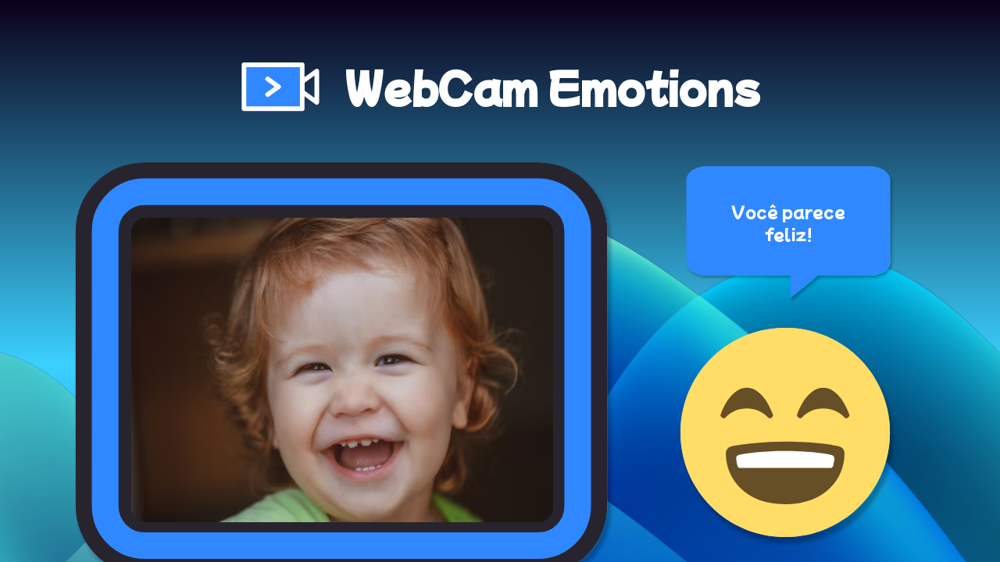

<h1 align="center">WebCam Emotions App</h1>

<h2 align="center">
Explore suas próprias expressões faciais em tempo real com nossa aplicação de reconhecimento facial! Descubra como diferentes emoções são capturadas através da sua webcam. Uma experiência prática e divertida para mergulhar no mundo do reconhecimento facial.
</h2>

<h3 align="center"> Este projeto foi desenvolvido com base em uma ideia encontrada em 
     <a target="_blank" href="https://codante.io/mini-projetos/reconhecimento-facial-com-react-e-tensorflow">codante</a>. 
</h3>

<h3 align="center">
     <a target="_blank" href="https://webcam-emotions-jonathankarlinski.vercel.app/">Testar Projeto</a>
</h3>

<h2>🎨 Demonstração</h2>

    

<h2>🛠 Conhecimentos Utilizados</h2>

- React JS
- FaceApi
- React WebCam
- React Hook
- Java Script
- React Router Dom

<h2>📫 Feedback</h2>

<h3 align="center">
     Se você tiver algum feedback, posso ser encontrado em:
</h3>

   
    

